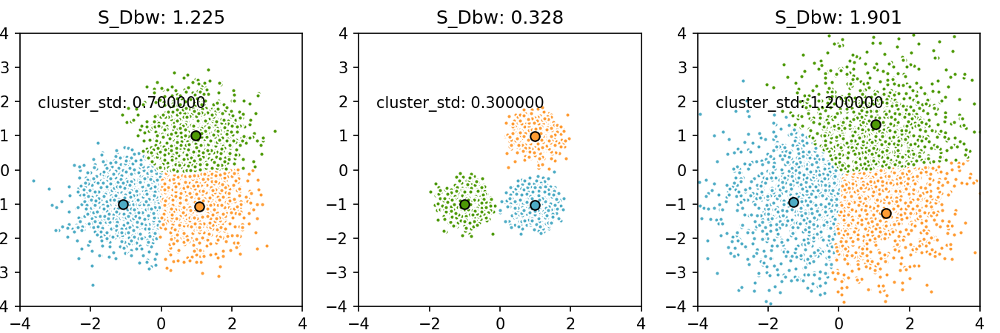
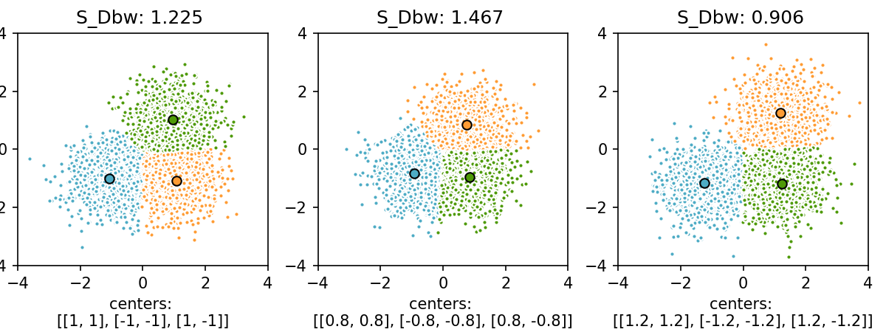

# S_Dbw validity index

> 代码全解析，可另见博文：https://iphysresearch.github.io/2018/04/S_Dbw/

此文的 motivation 来自于近期接的某无监督 k-means 聚类项目，并计划是用基于 K-means 算法的 [`k-prototypes`](https://github.com/nicodv/kmodes) 聚类算法来打发了事。为了对聚类结果给出合理靠谱的评估评价，最终决定主要参考 `S_Dbw` 评估指标，并且打算写作此文，非原理性的解析 `S_Dbw`，原因有二：

1. 在2001年，有一篇引用率挺高(300+)的 paper [^1]谈到说，`S_Dbw` 聚类评价指标对于各种噪声，不同密度的数据集等等干扰项来调参的鲁棒性最强，直接完爆其他所有评价指标~ 
2. `S_Dbw` 算法在 sciki-learn 中至今还没有被添加到 api 中 [^2]，相比， R 语言里却有现成且很好的 api 可以调用，如  [`clv`](https://rdrr.io/cran/clv/man/SD_SDbw.html) 和 [`NbClust`](https://github.com/cran/NbClust) [^3]。关于 `S_Dbw` 算法现成的 Python 代码版本，在网络上也难以寻觅，唯一的参考是 fanfanda 的 [版本](https://github.com/fanfanda/S_Dbw)。不过，此代码应该是有问题的，它聚类中心的定义是有误的。

综上，自己决定在 fanfanda 的代码基础上修正代码，并且贴出此代码算法的详细解析（详情见博文）。

博文注：符号完全参考论文原文，且已尽可能的说明算法的内涵和代码实现原理，更详细信息请参阅原论文。

> `S_Dbw` 算法的原论文地址：
>
> [Clustering Validity Assessment: Finding the optimal partitioning of a data set](https://pdfs.semanticscholar.org/dc44/df745fbf5794066557e52074d127b31248b2.pdf )


[^1]: [      Clustering validity assessment: Finding the optimal partitioning of a data set](http://ieeexplore.ieee.org/abstract/document/989517/) （[下载地址](http://datamining.rutgers.edu/publication/internalmeasures.pdf)）

[^2]: [     Add more unsupervised clustering metrics #6654](https://github.com/scikit-learn/scikit-learn/issues/6654)

[^3]: [NbClust: An R Package for Determining the Relevant Number of Clusters in a Data Set](https://www.jstatsoft.org/article/view/v061i06/v61i06.pdf)


---

## Example:

固定住模拟数据的中心点，变化散布程度：




变化模拟数据的中心点，固定每类的散布程度：




上面两个图的代码如下：（亦可见 `Plot.ipynb`）

```python
import numpy as np
import S_Dbw as sdbw
from sklearn.cluster import KMeans
from sklearn.datasets.samples_generator import make_blobs
from sklearn.metrics.pairwise import pairwise_distances_argmin

np.random.seed(0)

S_Dbw_result = []
batch_size = 45
centers = [[1, 1], [-1, -1], [1, -1]]
cluster_std=[0.7,0.3,1.2]
n_clusters = len(centers)
X1, _ = make_blobs(n_samples=3000, centers=centers, cluster_std=cluster_std[0])
X2, _ = make_blobs(n_samples=3000, centers=centers, cluster_std=cluster_std[1])
X3, _ = make_blobs(n_samples=3000, centers=centers, cluster_std=cluster_std[2])

import matplotlib.pyplot as plt
fig = plt.figure(figsize=(9, 3))
fig.subplots_adjust(left=0.02, right=0.98, bottom=0.08, top=0.9)
colors = ['#4EACC5', '#FF9C34', '#4E9A06']

for item, X in enumerate(list([X1, X2, X3])):
    k_means = KMeans(init='k-means++', n_clusters=3, n_init=10)
    k_means.fit(X)

    k_means_cluster_centers = k_means.cluster_centers_
    k_means_labels = pairwise_distances_argmin(X, k_means_cluster_centers)

    KS = sdbw.S_Dbw(X, k_means_labels, k_means_cluster_centers)
    S_Dbw_result.append(KS.S_Dbw_result())
    
    ax = fig.add_subplot(1,3,item+1)
    for k, col in zip(range(n_clusters), colors):
        my_members = k_means_labels == k
        cluster_center = k_means_cluster_centers[k]
        ax.plot(X[my_members, 0], X[my_members, 1], 'w',
                markerfacecolor=col, marker='.')
        ax.plot(cluster_center[0], cluster_center[1], 'o', markerfacecolor=col,
                markeredgecolor='k', markersize=6)
    ax.set_title('S_Dbw: %.3f' %(S_Dbw_result[item]))
    ax.set_ylim((-4,4))
    ax.set_xlim((-4,4))
    plt.text(-3.5, 1.8, 'cluster_std: %f' %(cluster_std[item]))
plt.savefig('./pic1.png', dpi=150)
```

```python
np.random.seed(0)

S_Dbw_result = []
batch_size = 45
centers = [[[1, 1], [-1, -1], [1, -1]],
            [[0.8, 0.8], [-0.8, -0.8], [0.8, -0.8]],
            [[1.2, 1.2], [-1.2, -1.2], [1.2, -1.2]]]
n_clusters = len(centers)
X1, _ = make_blobs(n_samples=3000, centers=centers[0], cluster_std=0.7)
X2, _ = make_blobs(n_samples=3000, centers=centers[1], cluster_std=0.7)
X3, _ = make_blobs(n_samples=3000, centers=centers[2], cluster_std=0.7)

import matplotlib.pyplot as plt
fig = plt.figure(figsize=(8, 3))
fig.subplots_adjust(left=0.02, right=0.98, bottom=0.2, top=0.9)
colors = ['#4EACC5', '#FF9C34', '#4E9A06']

for item, X in enumerate(list([X1, X2, X3])):
    k_means = KMeans(init='k-means++', n_clusters=3, n_init=10)
    k_means.fit(X)

    k_means_cluster_centers = k_means.cluster_centers_
    k_means_labels = pairwise_distances_argmin(X, k_means_cluster_centers)

    KS = sdbw.S_Dbw(X, k_means_labels, k_means_cluster_centers)
    S_Dbw_result.append(KS.S_Dbw_result())
    
    ax = fig.add_subplot(1,3,item+1)
    for k, col in zip(range(n_clusters), colors):
        my_members = k_means_labels == k
        cluster_center = k_means_cluster_centers[k]
        ax.plot(X[my_members, 0], X[my_members, 1], 'w',
                markerfacecolor=col, marker='.')
        ax.plot(cluster_center[0], cluster_center[1], 'o', markerfacecolor=col,
                markeredgecolor='k', markersize=6)
    ax.set_title('S_Dbw: %.3f ' %(S_Dbw_result[item]))
#     ax.set_xticks(())
#     ax.set_yticks(())
    ax.set_ylim((-4,4))
    ax.set_xlim((-4,4))
    ax.set_xlabel('centers: \n%s' %(centers[item]))
plt.savefig('./pic2.png', dpi=150)
```

